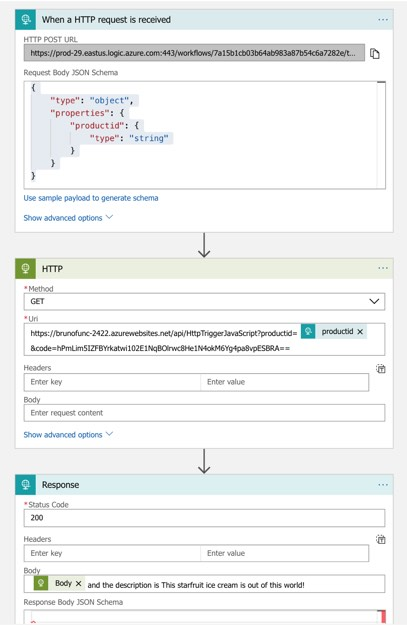

# Making functions work

## Developing functions locally

1. Install tools:
    ```bash
    #Scratch that
    #brew tap azure/functions
    #brew install azure-functions-core-tools
    #Using this instead https://blogs.msdn.microsoft.com/appserviceteam/2017/09/25/develop-azure-functions-on-any-platform/
    ````
1. Make your .env file
    ```bash
    cp .env.backup .env
    source .env
    ````

1. Setup a development environment
    ```bash
    mkdir $FUNC_BASEDIR/functions
    cd $FUNC_BASEDIR/functions
    npm i -g azure-functions-core-tools@core
    sudo npm i -g azure-functions-core-tools@core --unsafe-perm
    func init $FUNCTION_NAME
    cd $FUNCTION_NAME
    func new --language JavaScript --template HttpTrigger --name HttpTriggerJavaScript
    ````

1. Test it:
    ```bash
    func host start
    ```

1. Now you can curl it in a new terminal:
    ```bash
    curl http://localhost:7071/api/HttpTriggerJavaScript?name=$USER
    ```

## Publish function to Azure

1. Create an App service:

    ```bash
    az group create -n $RG -l $LOC
    az appservice plan create --name $APP_SVC_NAME -g $RG --sku S1
    ```
1. Create a Storage Account

    ```bash
    az storage account create \
    --location eastus \
    --name  $AZURE_STORAGE_ACCOUNT \
    --resource-group $RG \
    --sku Standard_LRS
    ```

1. Create Azure function

    ```bash
    export CURRENT_FUNCTION_NAME=$FUNCTION_NAME-${RANDOM:0:4} 
    az functionapp create --name $CURRENT_FUNCTION_NAME --storage-account  $AZURE_STORAGE_ACCOUNT  --resource-group $RG \
    --plan $APP_SVC_NAME
    ```

1. Publish function

    ```bash
    func azure functionapp publish $CURRENT_FUNCTION_NAME
    ```
1. Obtain the code from the portal. Open function portal from the left menu, then click on your app service, next click on the function and finally click on "Get function URL" to see the code needed to make calls to your public API

1. Curl it to test it:

    ```bash
    curl https://$CURRENT_FUNCTION_NAME.azurewebsites.net/api/HttpTriggerJavaScript\?code\=hPmLim5IZFBYrkatwi102E1NqBOlrwc8He1N4okM6Yg4pa8vpESBRA\=\=\&productid=$USER
    ```

## Setting up a logic App

1. Go to the portal an create a new Azure Logic App

https://portal.azure.com/#create/Microsoft.EmptyWorkflow

1. Go to Logic App Designer > When HTTP Request is received
Edit > Use sample payload to generate schema

    ```json
    {
        "productid": "75542e38-563f-436f-adeb-f426f1dabb5c"
    }
    ````

    This will generate something like the following:

    ```json
    {
        "type": "object",
        "properties": {
            "productid": {
                "type": "string"
            }
        }
    }
    ````

    Basically you need to create the following structure:

    